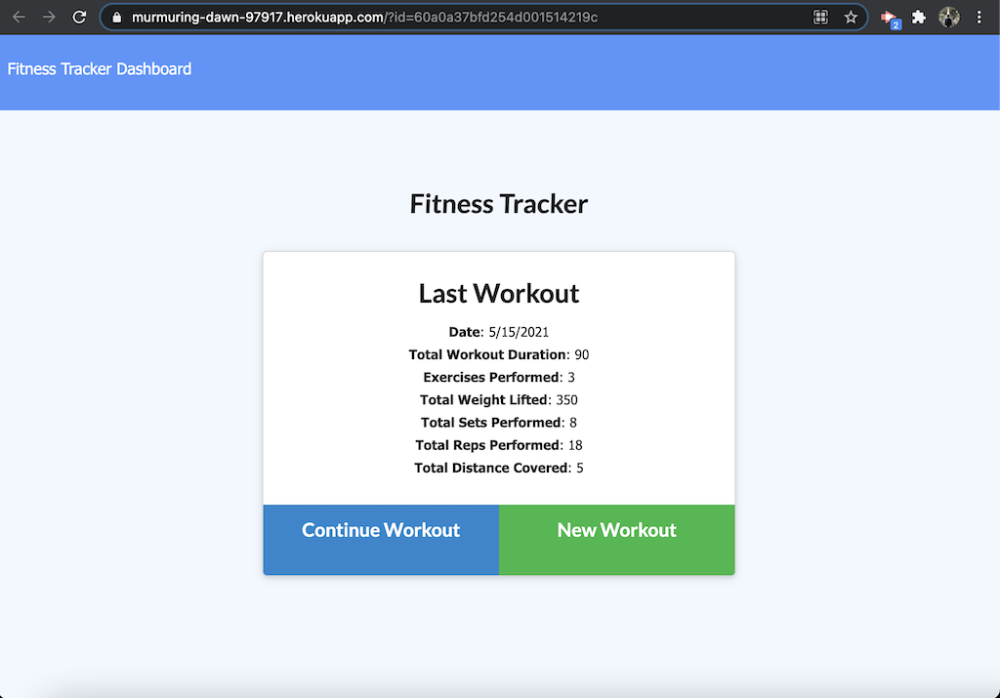
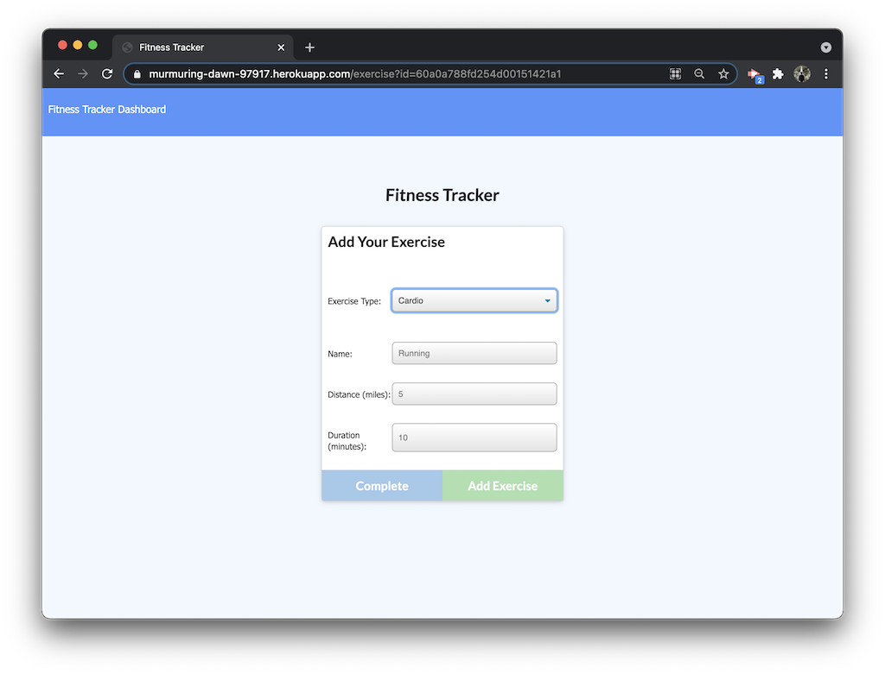
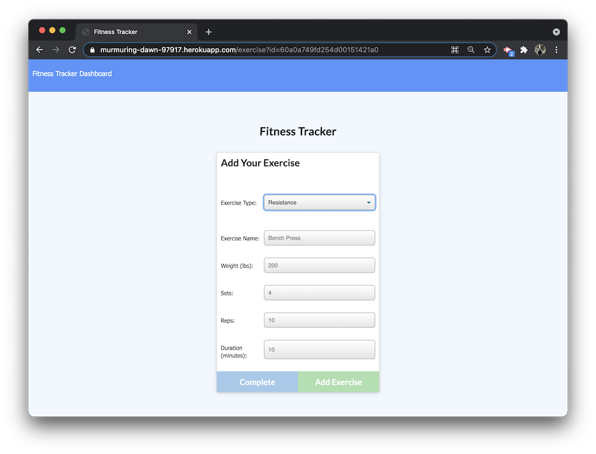
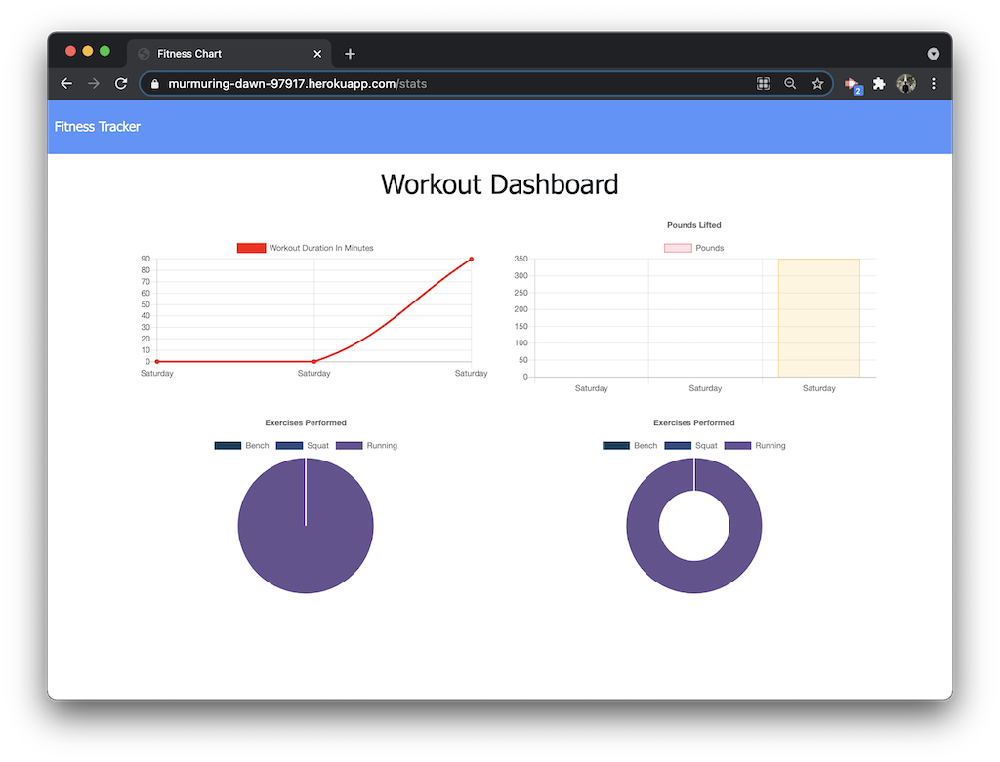

# Fitness Tracker App  

## User Story  
As a user, I want to be able to view create and track daily workouts.  
I want to be able to log multiple exercises in a workout on a given day.   
I should also be able to track the name, type, weight, sets, reps, and duration of exercise.   
If the exercise is a cardio exercise, I should be able to track my distance traveled.  

## How to use the app  
1. When presented with the landing page, you will see the stats from your last workout.  
     
2. To a new workout, click on New Workout.  
3. When prompted to Add Your Exercise, select an exercise type by selecting from the drop-down menu. Fields relevant to the exercise type will appear.  
     
     
4. Complete the fields.  
   1. To save this exercise and add another, click the 'Add Exercise' button and repeat the process.  
   2. When the final exercise is entered, click the 'Complete' button to return to the Workout summary.  
5. To add additional exercises to the last workout, select Continue Workout and run through the same steps to add and save exercises to the existing workout.  
6. Once back at the Workout summary page, click on Dashboard in the top left navigation bar to see in graph form the stats of your last 7 workouts.  
     

